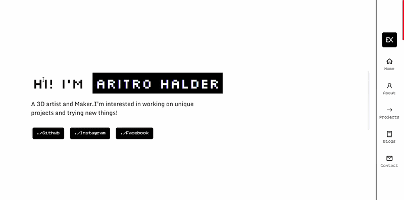
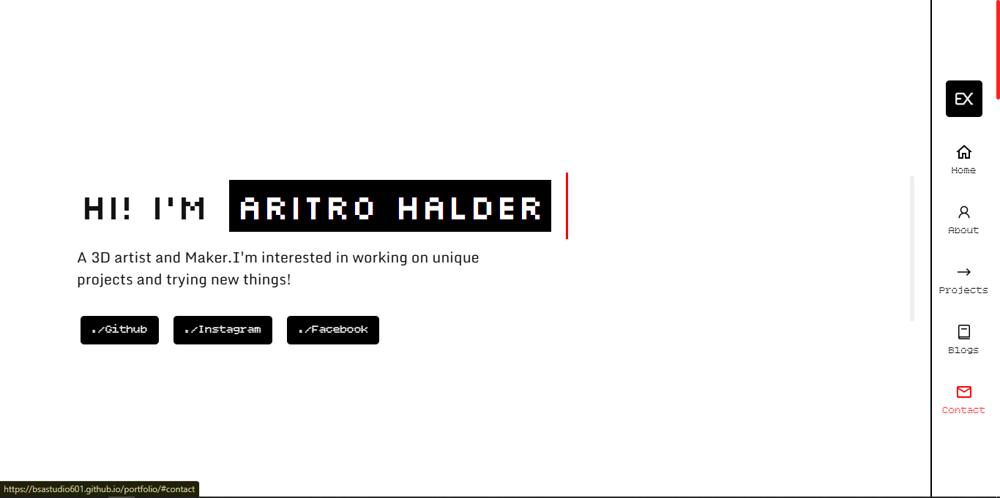

# Aritro's Portfolio

A personal portfolio showcasing my projects, devlogs, and creative work.
**Live Demo:** https://bsastudio601.github.io/portfolio/

---

## Screenshot

> Replace this with a screenshot or GIF of your portfolio.



---

## Features

* Retro-inspired design
* beautiful Responsive layout
* Typing animation
* Project showcase
* Blog pages
* Contact form
* Hosted with GitHub Pages

---

## How to Run Locally

Clone the repository:

```bash
git clone https://github.com/bsastudio601/portfolio.git
```

Open the project folder:

```bash
cd portfolio
```

You can also download .zip and extract the folder.

Since this is a static website, you can simply open `index.html` in your browser.

Alternatively, if you have VS Code installed, you can use the **Live Server** extension:

1. Open the project in VS Code.
2. Right-click `index.html`.
3. Select **Open with Live Server**.

---

Made with HTML, CSS, and JavaScript.
